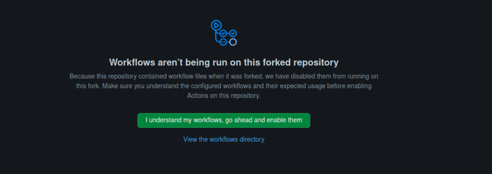

#  maven-hello-world

A simple Hello World application using Maven build tool and GitHub actions workflow.

#  Introduction

This repository contains a basic Java program that outputs "Hello World!" to the console, along with an accompanying pom.xml file that specifies the build configuration for Maven. The purpose of this project is to demonstrate the use of Maven for building and managing a Java project and a simple Github Actions pipeline to automate the process.

#  Maven Build Configuration

The pom.xml file in this repository provides a basic configuration for Maven, including the project's dependencies and build settings.

#  Dockerfile

This repository contains a multi-stage Dockerfile that builds and runs a Java application. The Dockerfile uses two base images: maven:3 and openjdk:8-jre.

#  Github Actions Pipeline

The Github Actions pipeline defined in this repository performs the following actions:

- Extract latest image tag from Docker Hub
- Increase the Patch part of the jar version (e.g. 1.0.0 -> 1.0.1) automatically.
- Create a Docker image using the command build, the "DockerMultiStage" file and the command mvn package inside it.
- Push the docker image that was created in the previous step to Docker Hub.
- Download and run the docker image.

#  Prerequisites

- Fork the repository
- Add Docker Hub credentials in repository secrets as follow:
    User name: DOCKERHUB_USERNAME
    Password: DOCKERHUB_PASSWORD
- Go to "Actions" on repository and turn on workflow by clicking the green button as shows in image:

- At line in workflow file (main.yml), change the environmente variable "REPO" value to your/desired repository.

#  Running the Pipeline
- Push changes and let the magic start:)

